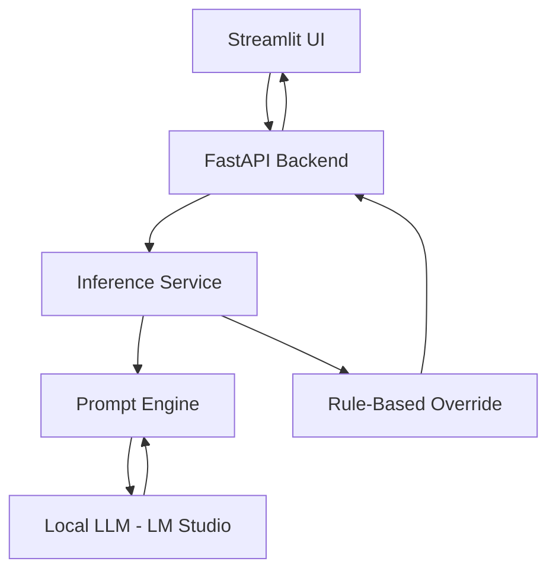

# Legal Contract Intelligence Engine (V1)

A professional-grade legal intelligence engine designed to analyze contracts, detect risks, and answer complex legal questions locally. This system leverages a local LLM through LM Studio and a hybrid reasoning engine to provide high-accuracy contract analysis without data leaving your machine.

## 📌 Project Overview
The Legal Contract Intelligence Engine (V1) is a privacy-first backend and UI for legal teams. It automates the extraction and analysis of clauses from complex legal documents. By combining **Few-Shot Prompting** with a **Deterministic Rule-Based Engine**, the system achieves production-grade accuracy for risk classification and clause typing while remaining 100% offline.

## ✨ Features
*   **Clause Classification**: Identifies clause types (Confidentiality, Liability, Termination, Indemnity, etc.).
*   **Deterministic Risk Detection**: Detects legal risks (Low/Medium/High) using a hybrid LLM + Rule-based logic.
*   **Contextual Legal Q&A**: Fast and accurate question-answering based on contract context.
*   **Automated Summarization**: Generates concise document-level summaries highlighting key obligations.
*   **Privacy First**: Fully offline execution via local LLM integration.

## 🏗️ System Architecture


## 🛠️ Tech Stack
*   **Backend**: FastAPI (Python 3.10+)
*   **Frontend**: Streamlit
*   **LLM Interface**: OpenAI-compatible Local API (Mistral-7B)
*   **Modeling**: LM Studio / Mistral-7B-Instruct-v0.2
*   **Data Handling**: Pandas, JSONL

## 📁 Project Structure
```text
src/
├── api/             # FastAPI routes and controllers
├── interfaces/      # LLM client abstractions
├── services/        # Business logic: Inference, Risk scoring
├── datapipeline/    # Data processing and preparation
└── app.py           # Main API entry point
ui/
└── app.py           # Streamlit application
data/
├── raw/             # Initial CSV/JSON datasets
├── processed/       # Structured dataset for analysis
└── fine_tune/       # Formatted samples for future fine-tuning
```

## 🚀 Setup Instructions

### 1. Prerequisites
*   Python 3.10+
*   [LM Studio](https://lmstudio.ai/) installed and running.

### 2. Configure LM Studio
1.  Open LM Studio and download `Mistral-7B-Instruct-v0.2`.
2.  Go to the **Local Server** tab.
3.  Select the model and click **Start Server** (listening on `http://localhost:1234`).

### 3. Backend Setup
```bash
# Clone the repository
git clone https://github.com/your-repo/legal-engine.git
cd legal-engine

# Install dependencies
pip install -r requirements.txt

# Start the FastAPI server
uvicorn src.app:app --host 0.0.0.0 --port 8000 --reload
```

### 4. UI Setup
```bash
# Run the Streamlit UI (in a new terminal)
streamlit run ui/app.py
```

## 🔌 API Endpoints

| Method | Endpoint | Description |
| :--- | :--- | :--- |
| `POST` | `/api/v1/analyze-risk` | Analyzes a clause and returns Type and Risk Level. |
| `POST` | `/api/v1/ask` | Answers a legal question based on contract context. |
| `POST` | `/api/v1/summarize` | Generates a document-level summary. |

## 📝 Example Usage

### Risk Analysis
```bash
curl -X POST http://localhost:8000/api/v1/analyze-risk \
     -H "Content-Type: application/json" \
     -d '{"clause": "The company total liability is limited to $1000."}'
```

### Response
```json
{
  "type": "Liability",
  "risk": "High",
  "explanation": "The clause contains a financial cap on liability, which is inherently High risk..."
}
```

## ⚠️ Limitations
*   **V1 Context Limit**: Analysis is performed per-clause to maintain accuracy within local LLM context windows.
*   **Stateless**: The current version does not persist analysis results across sessions.

## 🔮 Future Work (V2)
*   **RAG Integration**: Implementation of Vector DB (ChromaDB) for retrieval-augmented generation across multiple documents.
*   **Document Comparison**: Side-by-side analysis of original vs. redlined contracts.
*   **Fine-Tuning**: Leveraging the labeled `train.jsonl` data for task-specific Mistral fine-tuning.

---
Developed with ⚖️ by the Legal Intelligence Team.
